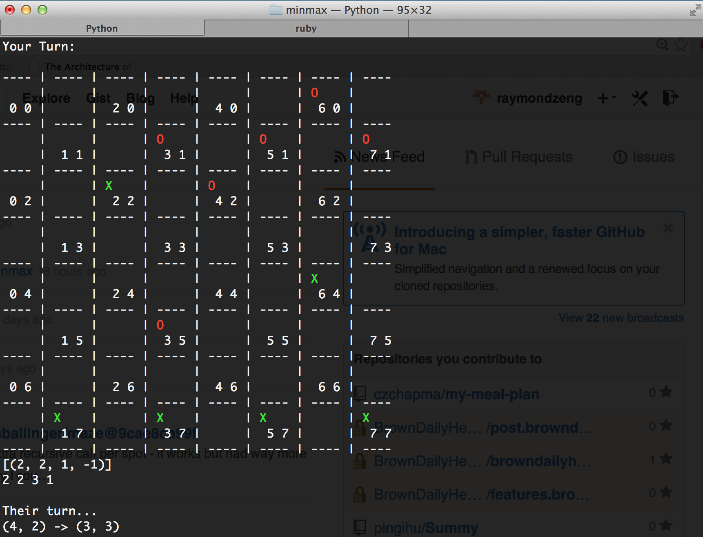

Minmax + AB Pruning
======
A minmax search with alpha-beta pruning "library". Comes with TicTacToe, Connect4, and Checkers AIs using said "library".

How to Use
===
Import `minmax_ai` and create an `AI` instance. WHen you want a move, call `get_move` with the current state.

```
import minmax_ai

opp = 'O'
player = 'X'

...

ai = minmax_ai.AI(ai_piece=opp,
                  opp=player,
                  depth=9,
                  game_over_fun=game_over,
                  eval_fun=evaluate,
                  moves_fun=possible_moves,
                  next_state_fun=next_state)

move = ai.get_move(current_state)
```

- `ai_piece` : However you represent the AI
- `opp`: However you represent the AI's opponent *the human player in most cases*
- `depth` : An integer. How many moves ahead you want the AI to look. The larger the depth, the longer the AI takes to think. 
- `game_over_fun` : a function determining if a game is over
- `eval_fun` : a static evaluation function for "scoring" a given state from the player's perspective (not the AI) 
- `moves_fun` : a function to generate all possible moves given a state
- `next_state_fun` : a function to generate a new state given an old state, the player whose turn it is, and the move  

Contract for the four functions (Haskell-style):  
`game_over_fun :: board -> player -> opponent -> boolean`    
`eval_fun :: board -> player -> opponent -> number`    
`moves_fun :: board -> player -> [move]`  
`next_state_fun :: board -> player -> move -> board`    

It doesn't matter what type of thing move is but it must be same thing that next_state_fun accepts.


Preview
===
A peek at the checkers AI. I thought it was being stupid by giving me a free king but very soon realized I was set up for a double jump. :sadface:


